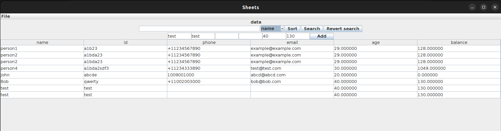

# Spreadsheet Application

A spreadsheet application written in Java, with Java Swing GUI.

This was created as a course project for UBC CPSC 210 (Software Construction).

## Features

- Sorting the rows by a column
- Searching for values
- Saving/loading spreadsheet files to JSON for persistence
- Logging important actions to `stdout`
- alternative CLI interface, parsing commands with regex
- 100% code coverage on the `model` and `persistence` packages, with tests written using JUnit
- Documented methods and classes

## Screenshot

